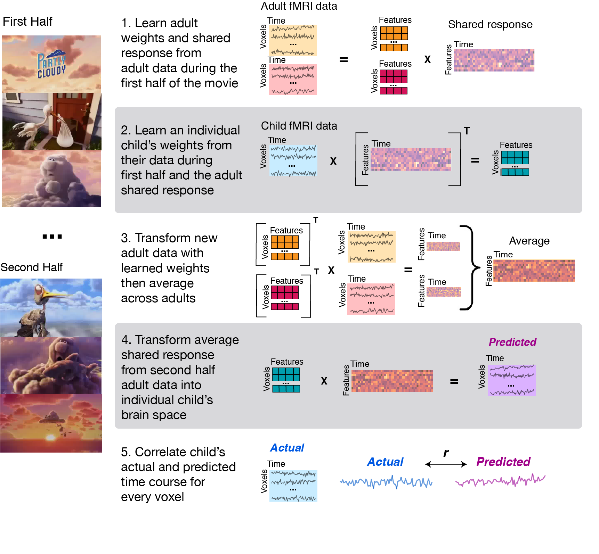

This is the code for performing the signal reconstruction analyses reported in "Emergence and organization of adult brain function through child development." Yates, Ellis, Turk-Browne (2020) https://www.sciencedirect.com/science/article/pii/S1053811920310910?via%3Dihub

**Abstract**

Adult cognitive neuroscience has guided the study of human brain development by identifying regions associated with cognitive functions at maturity. The activity, connectivity, and structure of a region can be compared across ages to characterize the developmental trajectory of the corresponding function. However, developmental differences may reflect both the maturation of the function and also its organization across the brain. That is, a function may be present in children but supported by different brain regions, leading its maturity to be underestimated. Here we test the presence, maturity, and localization of adult functions in children using shared response modeling, a machine learning approach for functional alignment. After learning a lower-dimensional feature space from fMRI activity as adults watched a movie, we translated these shared features into the anatomical brain space of children 3--12 years old. To evaluate functional maturity, we correlated this reconstructed activity with children’s actual fMRI activity as they watched the same movie. We found reliable correlations throughout cortex, even in the youngest children. The strength of the correlation in the precuneus, inferior frontal gyrus, and lateral occipital cortex predicted chronological age. These age-related changes were driven by three types of developmental trajectories: emergence from absence to presence, consistency in anatomical expression, and reorganization from one anatomical region to another. We also found evidence that the processing of pain-related events in the movie underwent reorganization across childhood. This data-driven, naturalistic approach provides a new perspective on the development of functional neuroanatomy throughout childhood.

**Scripts**

We have included our main analyses scripts and participant group labels files for replicating our results. The figure below illustrates the main steps used when running the signal reconstruction analysis. It is assumed that data has already been preprocessed (described below). Before implementing the main script, you must first edit the code in scripts/SR_utils.py marked "PARAMETERS" and make changes specific to your setup (e.g., location of preprocessed data, where data is to be stored). Here you should also indicate where you have stored the nifti file that is used for masking your data; in our analyses, we used the intersect brain mask of all participants created using the FSL merge command. 

**Environment setup** 

In order to run this code, python and BrainIAK must be in your environment. These modules are loaded in scripts/source_environment.sh. The code assumes that you use SLURM for your job submission, but could be edited to suit other cluster environments. Note however, some of these computations are time and memory intensive, depending on the number of subjects in the group used for learning the SRM features.

**Dataset and preprocessing information**

We analyze open-source data from the "Development of the social brain from age three to twelve years" by Hilary Richardson, Grace Lisandrelli, Alexa Riobueno-Naylor & Rebecca Saxe. The original paper can be found here: https://www.nature.com/articles/s41467-018-03399-2. We downloaded data from OpenNeuro: https://openneuro.org/datasets/ds000228/versions/1.0.0. 

Preprocessing was done using fmriprep 1.1.8. The script used to run fMRIprep is located in scripts/run_fmriprep.sh. Because slice acquisition for the adult sample (and some children) was different from that of most children, FSL's FLIRT command was then used to resample the adult and some children data to all have the same voxel dimensions (3.13 mm isotropic with 10% slice gap). The preprocessed outputs of fmriprep, resampled to the same voxel space, were then used for our analyses.

